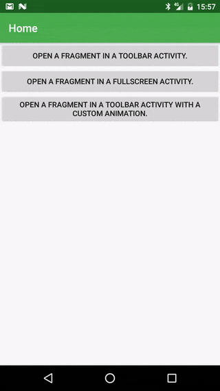

# Activity Fragment Manager 
[ ](https://bintray.com/jmspt/maven/activity-fragment-manager/)
[](https://travis-ci.org/massivedisaster/ActivityFragmentManager)

A library to help android developer working easly with activities and fragments 

## Motivation

* Accelerate the process and abstract the logic of opening, adding, and replacing fragments in an activity;
* Reduce the number of activities declared in the project;
* Add animated transitions between fragments in an easy way;

<div align="center">
  
  <br />
  <em>Sample</em>
</div>

## Download

To use the Activity Fragment Manager, add the compile dependency with the latest version.

### Gradle

Add the Activity Fragment Manager to your `build.gradle`:
```gradle
dependencies {
    compile 'com.massivedisaster:activity-fragment-manager:0.3.0'
}
```

### Maven

In the `pom.xml` file:
```xml
<dependency>
    <groupId>com.massivedisaster</groupId>
    <artifactId>activity-fragment-manager</artifactId>
    <version>0.3.0</version>
</dependency>
```

## Usage

### 1. Create your Activity

Create a new activity and extends the ```AbstractFragmentActivity```.

```java
public class ActivityPrimaryTheme extends AbstractFragmentActivity {

    // The layout resource you want to find the FrameLayout.
    @Override
    protected int getLayoutResId() {
        return R.layout.activity_primary;
    }

    // The FrameLayout id you want to inject the fragments.
    @Override
    protected int getContainerViewId() {
        return R.id.frmContainer;
    }

}

```

Create the layout to be used by your ```AbstractFragmentActivity```.
```xml
<?xml version="1.0" encoding="utf-8"?>
<FrameLayout
    xmlns:android="http://schemas.android.com/apk/res/android"
    android:id="@+id/frmContainer"
    android:layout_width="match_parent"
    android:layout_height="match_parent"/>
```

### 2. Opening, adding or replacing fragments in your AbstractFragmentActivity.

#### Open a new AbstractFragmentActivity with a fragment.
```java
ActivityFragmentManager.open(getActivity(), ActivityPrimaryTheme.class, FragmentExample.class);
```

#### Add a new Fragment in the actual AbstractFragmentActivity.
```java
ActivityFragmentManager.add(getActivity(), ActivityPrimaryTheme.class, FragmentExample.class);
```

#### Replace a new Fragment in the actual AbstractFragmentActivity.
```java
ActivityFragmentManager.replace((AbstractFragmentActivity) getActivity(), FragmentExample.class);
```

### 3. Default Fragment

You can set a default fragment in you ```AbstractFragmentActivity```.
An example, if your ```AbstractFragmentActivity``` is started by an external intent you need to define a default fragment.

```java
public class ActivityPrimaryTheme extends AbstractFragmentActivity {

    ...
    
    @Override
    protected Class<? extends Fragment> getDefaultFragment() {
        return FragmentSplash.class;
    }

}
```

### 4. Fragment Transaction Animations.
When you add or replace fragments in the old way you can set a custom animations for the transactions. So, you can set custom animation in easly way using this library.

#### Single Transaction Animation

If you want to add a single animation only for one transaction you can do this:
```java
ActivityFragmentManager.add((AbstractFragmentActivity) getActivity(), FragmentExample.class, new TransactionAnimation() {
                @Override
                public int getAnimationEnter() {
                    return R.anim.enter_from_right;
                }

                @Override
                public int getAnimationExit() {
                    return R.anim.exit_from_left;
                }

                @Override
                public int getAnimationPopEnter() {
                    return R.anim.pop_enter;
                }

                @Override
                public int getAnimationPopExit() {
                    return R.anim.pop_exit;
                }
            });
```

#### Custom animation for all transactions.

If you want to add a custom animation for all transactions inside of a ```AbstractFragmentActivity``` you can override the follow methods:
```java
public class ActivityPrimaryTheme extends AbstractFragmentActivity {

    ...
    
    @Override
    public int getAnimationEnter() {
        return R.anim.enter_from_right;
    }

    @Override
    public int getAnimationExit() {
        return R.anim.exit_from_left;
    }

    @Override
    public int getAnimationPopEnter() {
        return R.anim.pop_enter;
    }

    @Override
    public int getAnimationPopExit() {
        return R.anim.pop_exit;
    }

}
```

### 5. Custom Intents
Sometimes you want to add more information to the ```Intent``` or set some flags. You can use the follow method to open a new ```AbtractActivityFragment```:

```java
Intent intent = ActivityFragmentManager.getIntent(getContext(), ActivityPrimaryTheme.class, FragmentExample.class);
intent.setFlag(Intent.FLAG_ACTIVITY_NEW_TASK
                | intent.FLAG_ACTIVITY_CLEAR_TASK);
getActivity().startActivity(intent);
``` 

## Goodies

* You can pass a tag to be applied in the ```Fragment```.
* You can pass ```REQUEST_CODE``` to the ```startActivityForResult```.
* You can pass data between fragments using a ```Bundle```.

## Sample

Sample app can be found in the [sample module](sample). 
Alternatively, you can use [dryrun](https://github.com/cesarferreira/dryrun) to run the sample.

The Sample app don't require any configuration to interact.

## Contributing
[CONTRIBUTING](CONTRIBUTING.md)

## License
[MIT LICENSE](LICENSE.md)
